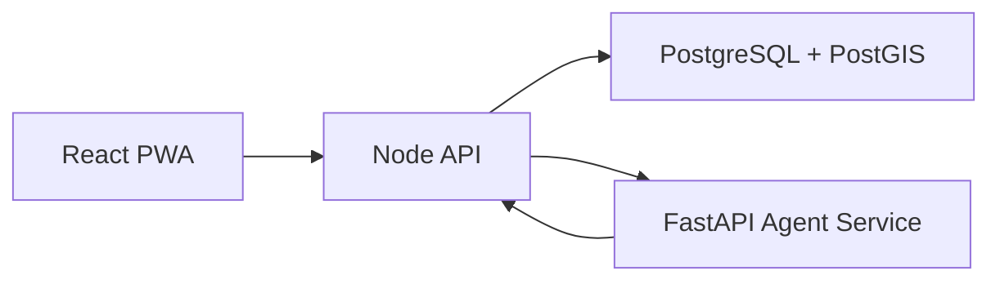

# NERVE Runtime Architecture

- The browser communicates only with the Node API.
- The Node API owns authentication, business rules and persistence.
- The Agent service owns stateful agent workflows and model inference.
- Agent tools call validated API functions; they never receive unrestricted database access.
