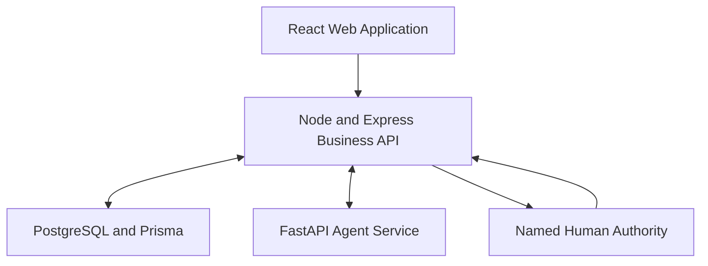
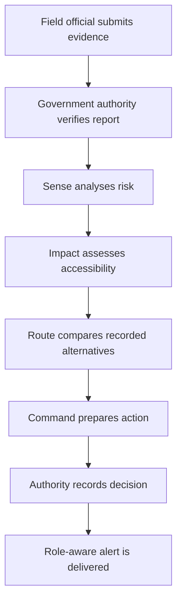
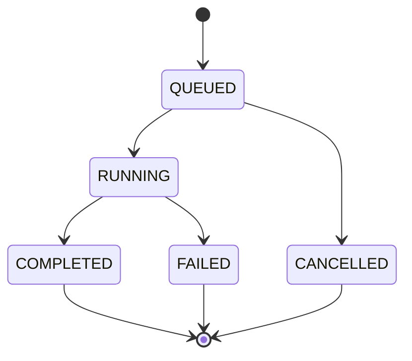
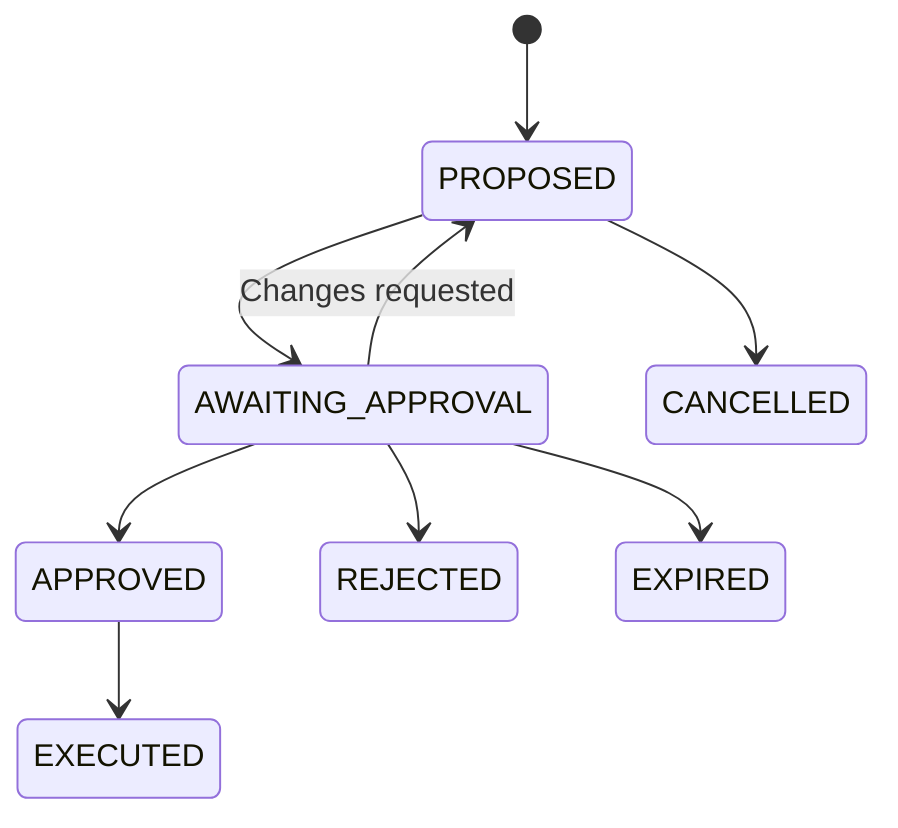

# NERVE System Architecture

## 1. Architecture objective

NERVE is designed as a human-supervised decision-support platform for landslide-risk intelligence, community accessibility and emergency logistics.

The architecture separates:

- User interaction
- Business rules
- Persistent operational data
- Specialist-agent reasoning
- Human approval
- Operational communication

No specialist agent directly executes a critical physical action.

## 2. High-level architecture



## 3. Application layers

### Web layer

Location:

```text
apps/web
```

Responsibilities:

- Role-based user interface
- Authenticated API requests
- Operational dashboards
- Field-evidence review
- Agent execution inspection
- Human approval controls
- Alert acknowledgement
- Loading, error and empty states

Technology:

- React
- TypeScript
- Vite
- React Router

### Business API layer

Location:

```text
apps/api
```

Responsibilities:

- Authentication and authorisation
- Request validation
- Operational business rules
- Database transactions
- Agent-service orchestration
- Approval enforcement
- Audit-record creation
- Notification delivery
- Error handling

Technology:

- Node.js
- Express
- TypeScript
- Zod
- Prisma

### Persistence layer

Location:

```text
apps/api/prisma
```

Database:

```text
PostgreSQL
```

Important entities:

- User
- Session
- AuditLog
- RoadCorridor
- RoadSegment
- Community
- CorridorCommunity
- CriticalFacility
- Incident
- IncidentCommunityImpact
- FieldReport
- Delivery
- RoutePlan
- AgentRun
- AgentToolCall
- AgentRecommendation
- ApprovalDecision
- OperationalNotification

### Agent-service layer

Location:

```text
apps/agent-service
```

Responsibilities:

- Specialist-agent input validation
- Explainable deterministic analysis
- Tool-call result generation
- Recommendation preparation
- Explicit limitation reporting
- Safe handoff to the next agent

Technology:

- Python
- FastAPI
- Pydantic

## 4. Specialist agents

### NERVE Sense

Input:

- Verified field-report title
- Observation description
- Latitude and longitude
- Media references
- Linked corridor, road segment and incident
- Capture and verification timestamps

Tools:

- `validate_geolocation`
- `classify_field_evidence`

Output:

- Risk score
- Risk level
- Evidence signals
- Confidence
- Explainable reasoning
- Recommended next action
- Impact-agent handoff

Safety:

- Only verified evidence starts the workflow.
- Sense does not close roads.
- Sense does not dispatch vehicles.

### NERVE Impact

Input:

- Completed Sense result
- Affected corridor
- Corridor-linked communities
- Population information
- Critical-facility counts
- Recorded corridor alternatives

Tools:

- `assess_corridor_dependencies`
- `summarise_community_exposure`

Output:

- Communities reviewed
- Communities without a recorded open alternative
- Potentially exposed population
- Critical facilities without a recorded alternative
- Explainable connectivity assessment
- Route-agent handoff

Safety:

- The result is a corridor-failure scenario.
- It does not claim confirmed isolation.
- Population is potential exposure, not casualties.

### NERVE Route

Input:

- Completed Impact result
- Delivery records
- Stored route plans
- Route geometry availability
- Stored route risk scores
- Delivery priority and status

Tools:

- Recorded-route assessment
- Lower-risk route comparison

Output:

- Recorded-route recommendation
- Delivery-hold recommendation when required
- Risk reduction
- Evidence-backed reasons
- Command-agent handoff

Safety:

- Route only evaluates routes already stored in the platform.
- Stored geometry does not prove live passability.
- Field confirmation is required before movement.

### NERVE Command

Input:

- Completed Route result
- Route decisions
- Potential community exposure
- Corridor-risk context
- Delivery context

Tools:

- `consolidate_agent_evidence`
- `build_supervised_action_plan`

Output:

- Critical or high-priority recommendation
- Explainable action plan
- Required prerequisites
- Evidence snapshot
- Human-approval lock

Safety:

- `requiresApproval` is true.
- `executionBlockedUntilApproval` is true.
- No automatic delivery or route mutation occurs.

## 5. End-to-end workflow



## 6. Verification transaction

When a Government Authority verifies a field report:

1. The API validates the field-report identifier.
2. The API validates the verification request.
3. Role authorisation is checked.
4. The field report is updated inside a database transaction.
5. A queued Sense `AgentRun` is created.
6. The Sense service is called.
7. Sense input, output and tool calls are persisted.
8. A successful Sense run is handed to Impact.
9. Impact is handed to Route.
10. Route is handed to Command.
11. Command recommendations are stored as `AWAITING_APPROVAL`.
12. The API returns the complete supervised workflow result.

A failed downstream handoff does not erase the verified field report or earlier successful agent traces.

## 7. Agent-run lifecycle



Each agent run stores:

- Agent type
- Trigger
- Status
- Input snapshot
- Output snapshot
- Start time
- Completion time
- Error message
- Tool-call records
- Linked recommendations

## 8. Human approval lifecycle



The MVP records accountable approval decisions but does not automatically execute physical delivery movement.

## 9. Auditability

NERVE preserves evidence at multiple levels.

### Field evidence

- Reporter
- Geo-coordinates
- Observation
- Media URLs
- Capture time
- Verification status

### Agent evidence

- Input snapshot
- Output snapshot
- Tool request
- Tool response
- Tool status
- Error details
- Execution timestamps

### Human decision evidence

- Recommendation
- Named actor
- Actor role
- Decision
- Comment
- Decision timestamp

## 10. Authentication and security

The business API uses:

- JWT access authentication
- Refresh-session handling
- Role-based authorisation
- Password hashing
- Zod input validation
- Helmet security headers
- Configured CORS policy
- Rate limiting
- Protected operational endpoints
- Database-backed audit records

Security rules:

- Operational endpoints reject unauthenticated requests.
- Only authorised roles can verify evidence.
- Only Government Authorities can approve critical actions.
- Secrets are loaded from environment variables.
- Real secrets must never be committed.

## 11. Failure handling

### Agent service unavailable

- API health becomes degraded.
- The stored field report remains available.
- Failed agent runs preserve an error message.
- Operators can inspect failure evidence.

### Invalid agent input

- FastAPI returns HTTP `422`.
- No downstream operation executes.

### Unauthenticated API request

- Business API returns HTTP `401`.

### Failed tool call

- Tool-call status is recorded as failed.
- Error details are persisted.
- The agent run cannot silently appear successful.

### Missing connectivity data

- Impact returns an insufficient-data assessment.
- Field verification is recommended.
- Isolation is not assumed.

### No safer route

- Route recommends a supervised delivery hold.
- A route is not invented.

## 12. Observability

The Agent Activity workspace displays:

- Total specialist agents
- Completed runs
- Verified tool calls
- Human checkpoints
- Individual execution traces
- Input snapshots
- Output snapshots
- Tool-call sequence
- Recommendations
- Human-oversight status

Health endpoints:

```text
GET http://localhost:4000/api/v1/health
GET http://127.0.0.1:8000/health
```

## 13. Validation strategy

The project uses:

- TypeScript compiler checks
- Vite production build
- Python compile checks
- Prisma migration validation
- Direct agent endpoint verification
- Database evidence inspection
- End-to-end PowerShell smoke tests
- Manual browser workflow verification

The smoke suite validates 20 critical behaviours, including authentication, invalid input handling, agent execution and automatic-execution blocking.

## 14. Responsible-AI boundaries

The current agents are explainable rule-based prototypes.

They are not:

- Trained machine-learning risk models
- Calibrated probability estimators
- Complete road-network simulators
- Replacements for field officials
- Autonomous dispatch systems

Operational decisions must include:

- Current weather information
- Live field confirmation
- Named authority review
- Local emergency procedures
- Human responsibility

## 15. Future extension points

Possible future improvements:

- IMD forecast integration
- Satellite rainfall and soil-moisture inputs
- DEM-based terrain analysis
- Full road-network graph analysis
- Live vehicle telemetry
- Multilingual alerts
- Offline field-report synchronisation
- Calibrated risk models
- Mobile field application
- Deployment monitoring and tracing